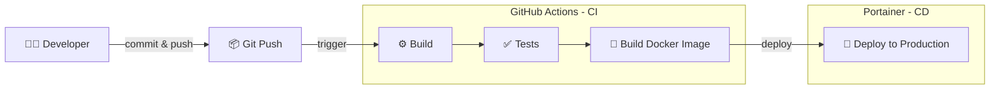

# MiniBnB Backend 🚀

> RESTful API backend for MiniBnB platform built with Express.js, TypeScript, and Supabase

## 📋 Table of Contents

- [Overview](#overview)
- [Tech Stack](#tech-stack)
- [Prerequisites](#prerequisites)
- [Getting Started](#getting-started)
- [Quick Start (Local Development)](#quick-start-local-development)
- [Development](#development)
- [Testing](#testing)
- [Deployment](#deployment)
- [CI/CD Pipeline](#cicd-pipeline)
- [API Documentation](#api-documentation)
- [Project Structure](#project-structure)

## 🎯 Overview

MiniBnB Backend is a robust RESTful API that powers the MiniBnB vacation rental platform. It provides endpoints for user management, property listings, bookings, messaging, and more.

**Key Features:**

- 🔐 Authentication with Supabase
- 🏠 Listing management (CRUD operations)
- 📅 Booking system
- 💬 Real-time messaging integration
- 👥 User profiles and host management
- 🤝 Co-host system
- 📊 Redis caching for performance
- 📝 Swagger API documentation
- ✅ Comprehensive test coverage with Jest

## 🛠 Tech Stack

### Core Framework

- **[Express.js 5](https://expressjs.com/)** - Fast, minimalist web framework
- **[TypeScript](https://www.typescriptlang.org/)** - Type-safe JavaScript
- **[Node.js](https://nodejs.org/)** >= 20.x - JavaScript runtime

### Database & Storage

- **[Supabase](https://supabase.com/)** - PostgreSQL database and authentication
- **[Redis](https://redis.io/)** - In-memory caching layer

### Validation & Security

- **[Zod](https://zod.dev/)** - TypeScript-first schema validation
- **[Helmet](https://helmetjs.github.io/)** - Security headers
- **[CORS](https://github.com/expressjs/cors)** - Cross-origin resource sharing

### Documentation & Testing

- **[Swagger](https://swagger.io/)** - API documentation (OpenAPI 3.0)
- **[Jest](https://jestjs.io/)** - Testing framework
- **[Supertest](https://github.com/ladjs/supertest)** - HTTP assertions

### Developer Experience

- **[tsx](https://github.com/privatenumber/tsx)** - TypeScript execution and watch mode
- **[ts-jest](https://kulshekhar.github.io/ts-jest/)** - TypeScript preprocessor for Jest

## ✅ Prerequisites

- **Node.js** >= 20.x
- **npm** (comes with Node.js)
- **Redis** (local or remote instance)
- **Supabase** account and project
- **Docker** (for containerized deployment)

## 🚀 Getting Started

### 1. Clone the repository

```bash
git clone <repository-url>
cd minibnb-groupA-backend
```

### 2. Install dependencies

```bash
npm install
```

### 3. Configure environment variables

Copy the example environment file:

```bash
cp .env.example .env
```

Update `.env` with your configuration:

```env
NODE_ENV=development
PORT=3001

# Supabase
SUPABASE_URL=https://xxx.supabase.co
SUPABASE_ANON_KEY=your_anon_key_here
SUPABASE_SERVICE_ROLE_KEY=your_service_role_key_here

# Redis
REDIS_HOST=localhost
REDIS_PORT=6379
REDIS_PASSWORD=

# CORS
FRONTEND_URL=http://localhost:3000
```

### 4. Start development server

```bash
npm run dev
```

The API will be available at `http://localhost:3001`

## ⚡ Quick Start (Local Development)

**TL;DR** - Pour lancer le backend rapidement en local :

```bash
# Installer les dépendances
npm i

# Démarrer Redis avec Docker Compose
docker compose up -d

# Lancer le serveur de développement
npm run dev
```

> **Note:** Assurez-vous d'avoir configuré votre fichier `.env` avant de lancer le serveur. Le `docker compose up -d` démarre Redis en arrière-plan.

## 💻 Development

### Available Scripts

| Script                  | Description                              |
| ----------------------- | ---------------------------------------- |
| `npm run dev`           | Start development server with hot reload |
| `npm run build`         | Compile TypeScript to JavaScript         |
| `npm start`             | Start production server (requires build) |
| `npm test`              | Run tests                                |
| `npm run test:watch`    | Run tests in watch mode                  |
| `npm run test:coverage` | Run tests with coverage report           |
| `npm run test:ci`       | Run tests in CI mode                     |
| `npm run seed`          | Seed database with sample data           |

### Development Workflow

1. Create a new branch for your feature
2. Make your changes
3. Run tests: `npm test`
4. Build to verify: `npm run build`
5. Commit and push your changes
6. Create a pull request

## 🧪 Testing

The project uses **Jest** for testing with **Supertest** for HTTP assertions.

### Run all tests

```bash
npm test
```

### Run tests in watch mode

```bash
npm run test:watch
```

### Generate coverage report

```bash
npm run test:coverage
```

Coverage reports are generated in the `coverage/` directory.

## 🐳 Deployment

### Docker Deployment

Build and run with Docker:

```bash
# Build the image
docker build -t minibnb-backend .

# Run the container
docker run -p 3001:3001 \
  -e SUPABASE_URL=your_url \
  -e SUPABASE_ANON_KEY=your_key \
  minibnb-backend
```

### Production Build

```bash
# Build TypeScript
npm run build

# Start production server
npm start
```

## 🔄 CI/CD Pipeline

The project uses **GitHub Actions** for continuous integration and deployment to **Portainer**.

### Pipeline Stages



### Workflow Steps

1. **Test** - TypeScript build and Jest tests
2. **Build & Push** - Build Docker image and push to GitHub Container Registry
3. **Deploy** - Deploy to Portainer using webhooks

### Required Secrets

Configure these secrets in your GitHub repository:

- `SUPABASE_URL` - Supabase project URL
- `SUPABASE_ANON_KEY` - Supabase anonymous key
- `SUPABASE_SERVICE_ROLE_KEY` - Supabase service role key
- `FRONTEND_URL` - Frontend application URL
- `BACKEND_URL` - Backend API URL (production)
- `REDIS_HOST` - Redis host
- `REDIS_PORT` - Redis port
- `DOCKER_PORTAINER_URL` - Portainer instance URL
- `DOCKER_PORTAINER_USER` - Portainer username
- `DOCKER_PORTAINER_PASSWORD` - Portainer password
- `PORTAINER_STACK_NAME` - Stack name in Portainer

## 📝 API Documentation

### Swagger UI

The API documentation is available via Swagger UI at multiple endpoints:

- `http://localhost:3001/docs`
- `http://localhost:3001/v1/docs`
- `http://localhost:3001/api/v1/docs`

### Health Check

```bash
GET /health
```

Returns server status and timestamp.

### Root Endpoint

```bash
GET /
```

Returns API information and available documentation endpoints.

## 📁 Project Structure

```
minibnb-groupA-backend/
├── .github/
│   └── workflows/          # GitHub Actions workflows
│       ├── ci.yml         # Continuous Integration
│       └── deploy.yml     # Build and Deploy
├── src/
│   ├── __tests__/         # Test files
│   ├── app.ts             # Express app setup
│   ├── config/            # Configuration files
│   │   ├── env.ts        # Environment variables
│   │   ├── redis.ts      # Redis configuration
│   │   └── swagger.ts    # Swagger setup
│   ├── constants/         # Application constants
│   ├── middlewares/       # Express middlewares
│   │   ├── auth.middleware.ts
│   │   ├── cache.middleware.ts
│   │   └── error.middleware.ts
│   ├── routes/            # API routes
│   │   ├── index.ts      # Routes aggregator
│   │   ├── auth.routes.ts
│   │   ├── listings.routes.ts
│   │   ├── bookings.routes.ts
│   │   └── ...
│   ├── services/          # Business logic
│   │   ├── auth.service.ts
│   │   ├── listing.service.ts
│   │   └── ...
│   ├── types/             # TypeScript types
│   ├── utils/             # Utility functions
│   ├── validators/        # Zod schemas
│   └── scripts/           # Utility scripts
│       └── seed.ts       # Database seeding
├── tests/                 # Integration tests
├── .env.example           # Environment variables template
├── Dockerfile             # Docker configuration
├── docker-compose.prod.yml # Production Docker Compose
├── jest.config.js         # Jest configuration
├── tsconfig.json          # TypeScript configuration
└── package.json           # Dependencies and scripts
```

## 📝 Environment Variables

| Variable                    | Description                          | Required        |
| --------------------------- | ------------------------------------ | --------------- |
| `NODE_ENV`                  | Environment (development/production) | ✅              |
| `PORT`                      | Server port                          | ✅              |
| `SUPABASE_URL`              | Supabase project URL                 | ✅              |
| `SUPABASE_ANON_KEY`         | Supabase anonymous key               | ✅              |
| `SUPABASE_SERVICE_ROLE_KEY` | Supabase service role key            | ✅              |
| `REDIS_HOST`                | Redis host                           | ✅              |
| `REDIS_PORT`                | Redis port                           | ✅              |
| `REDIS_PASSWORD`            | Redis password                       | Optional        |
| `FRONTEND_URL`              | Frontend application URL             | ✅              |
| `BACKEND_URL`               | Backend URL (for CORS)               | Production only |

## 📄 License

This project is part of an academic assignment.

---

Built with ❤️ using Express.js and TypeScript
